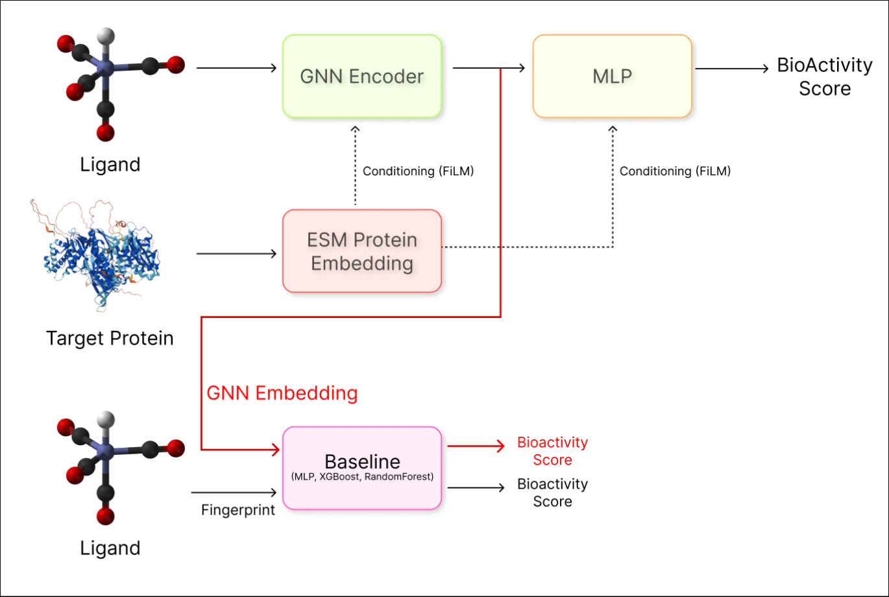

# Transfer Learning for Bioactivity Prediction  
### of Low-Resource Biological Targets

### Machine Learning for Drug Design 2026

**Authors**  
Bartłomiej Chmiel · Jędrzej Irla · Jakub Stępień · Alicja Wojciechowska

  

---

# Overview

This project investigates the use of **Transfer Learning** for predicting molecular bioactivity on **poorly characterized biological targets**.

The central research question is:

> Can molecular representations learned from large and diverse bioactivity datasets improve predictive performance on targets with limited labeled data?

The project combines:
- classical machine learning methods,
- graph neural networks (GNNs),
- transfer learning strategies,
- and chemical space analysis.

---

# Project Hypotheses

We investigate three main hypotheses:

1. **Transfer learning improves predictive performance** for low-data bioactivity tasks compared to models trained from scratch.

2. **Pretrained molecular representations** learned on large heterogeneous datasets generalize better to unseen biological targets.

3. **Transfer effectiveness depends on similarity** between source and target biological domains.

---
