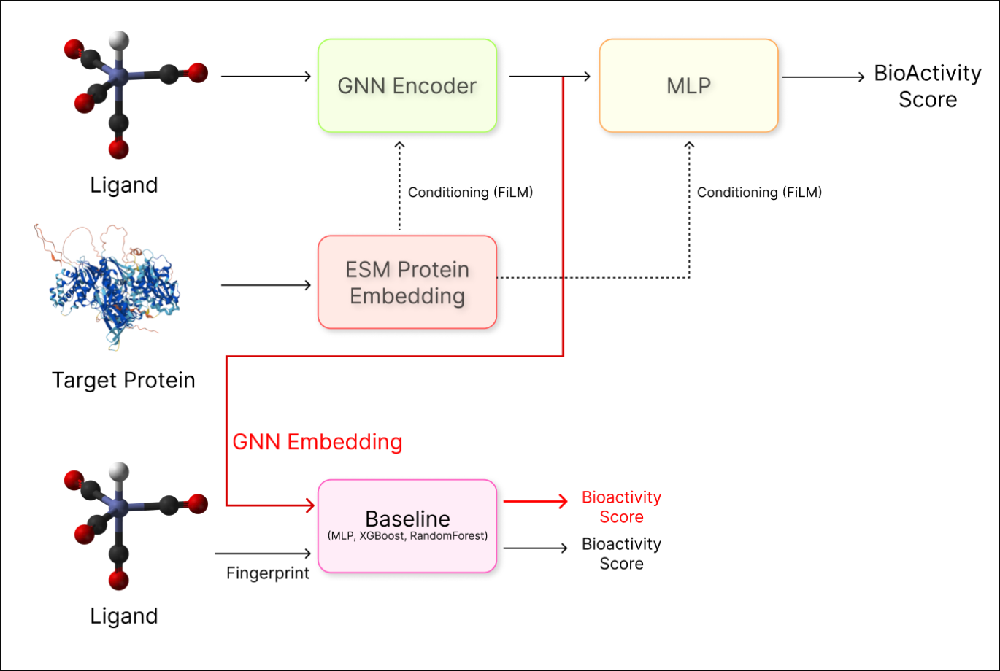

<div align="center">

# Transfer Learning for Bioactivity Prediction  
### of Low-Resource Biological Targets


[]()
[]()
[]()
[]()


### Machine Learning for Drug Design 2026

**Authors**  
Bartłomiej Chmiel · Jędrzej Irla · Jakub Stępień · Alicja Wojciechowska

</div>

<p align="center">
  
</p>

---

# Overview

This project investigates the use of **Transfer Learning** for predicting molecular bioactivity on **poorly characterized biological targets**.

The central research question is:

> Can molecular representations learned from large and diverse bioactivity datasets improve predictive performance on targets with limited labeled data?

The project combines:
- classical machine learning methods,
- graph neural networks (GNNs),
- transfer learning strategies,
- and chemical space analysis.

---

# Project Hypotheses

We investigate three main hypotheses:

1. **Transfer learning improves predictive performance** for low-data bioactivity tasks compared to models trained from scratch.

2. **Pretrained molecular representations** learned on large heterogeneous datasets generalize better to unseen biological targets.

3. **Transfer effectiveness depends on similarity** between source and target biological domains.

---
# Project structure
- `assets/` - images, figures and othere visual artefacts
- `configs/` - example configs used in training
- `notebooks/` - notebooks with some exploratory analyses
- `results/` - logs from conducted experiments
- `scripts/` - useful CLI scripts
- `src/` - implementation

---

# How to run

### Environment
Project was built with `Python 3.11` however as long as you are able to setup your environment with specified dependencies everything should work fine

To setup project simply run:
```bash
pip install ./
```
or if you'd like to customize any functionality inside `src` run
```bash
pip install -e ./
```

### Preparing datasets
Project utilizes custom built upstream and downstream molecule datasets based on ChEMBL database, we provide scripts to automatically generate both:

```bash
python scripts/generate_downstream_dataset.py --help

python scripts/generate_upstream_dataset.py --help
```

To train GNN or compute GNN embeddings, you can pre-download target protein sequences to avoid redownloading them every time

```bash
python scripts/fetch_target_sequences.py --help
```

### Upstream training
To train our Multi Taret GINE you can use:

```bash
python scripts/train_upstream_gnn.py --config <path_to_config_file>
```
Config structure is defined inside `src/upstream/train.py` you can check example configs in `configs/upstream`

To evaluate trained GINE on your preferred dataset you can use:
```bash
python scripts/evaluate_gnn.py --help
```

### Downstream training + Transfer learning

For downstream training using both fingerprints and GNN embeddings you can use:
```bash
python scripts/train_downstream.py --help
```
You can pick between different downstream models, datasets, representations and train for classification or regression

For example:
```bash
python scripts/train_downstream.py --model xgboost --task regression --train-csv <train_set_path> --val-csv <val_set_path> --test-csv <test_set_path> --gnn <gnn_checkpoint_path>
```
will train an xgboost regression model using GNN embeddings